# reto-advancelatam

El reto de desarrollo consist en:

A continuación se detalla los requerimientos funcionales y no funcionales.
El ejercicio solicitamos es una aplicación web para registro de autos y validación de pico y placa. Esta aplicación debe:

1. Tener 2 opciones: 1. Ingreso de información de auto, 2. Consulta si un vehículo registrado puede circular en una fecha dada.
2. El ingreso de información del auto debe capturar PLACA, color, modelo, chasis, cualquier otra información referente al vehículo. La información debe almacenarse en una base de datos de tu elección.
3. El formulario de consulta debe permitir ingresar la placa y la fecha actual con las horas.
4. Se debe validar que la fecha ingresada no sea anterior a la fecha y hora actual.
5. Debe mostrar el resultado en un popup con la información del auto y un texto que indique si es libre de circular en la fecha y hora ingresada.
6. El aplicativo debe tener dos partes un frontend en Angular o React (A tu elección) y el backend puede estar realizado en Springboot o Microprofile (Igualmente a tu elección).
7. La comunicación con el backend será mediante REST usando HTTP.
8. Toda la lógica de consulta y validación del pico y placa debe estar en el backend.
9. Se debe asumir que la aplicación debe estar lista para salir a producción.
10. Crear el código del aplicativo y subirlo en github con un README indicando como desplegar y correr tu proyecto.

# Configuracion de ambiente

## Backend

Para deployar el código [https://github.com/xzabalam/reto-advancelatam/tree/master/reto-advance-latam](https://github.com/xzabalam/reto-advancelatam/tree/master/reto-advance-latam) se debe realizar un clone del proyecto o descargar el zip en cualquier carpeta del sistema operativo.

Y desde una consola se debe ejecutar el comando

```bash
mvn clean install
```

Despúes de esto se debe abrir el proyecto en un IDE de desarrollo. El IDE de desarrollo utilizado para codificar el aplicativo es IntelliJIdea Ultimate versión 2022.3.2.

En el IDE se debe importar el proyecto. Cuando se haya finalizado la importación del proyecto, se debe abrir el archivo "RetoAdvanceLatamApplication.java" y con el botón derecho del mouse dar click en cualquier parte del archivo y seleccionar la opción "Run RetoAdvanceLatamApplication".

Debido a que se está utilizando H2 como base de datos en memoria, el aplicativo se encarga de crear automáticamente la base de datos, validar que el modelo de entidades en jpa sea el mismo de las tablas de base de datos. Del proceso de creación de la base de datos se encarga Flyway.

El aplicativo está listo para ejecutar en modo producción. El puerto configurado es para producción es el 8080. Pero si se desea ejecutar el app en ambiente de desarollo se debe editar los ajustes de configuraciones y en la sección "Active Profiles" debe quedar como en la imagen siguiente:

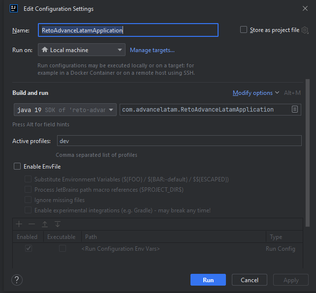

El puerto para el ambiente de desarrollo es el 8082.

En ambiente de desarrollo se habilitará el log de consultas sql.

En la carpeta "Postman" se encuentra la colección de las solicitudes al api rest, el archivo se llama "PicoPlaca.postman_collection.json".

La documentación del api rest se la puede revisar en el siguiente link: http://localhost:8080/swagger-ui/index.html

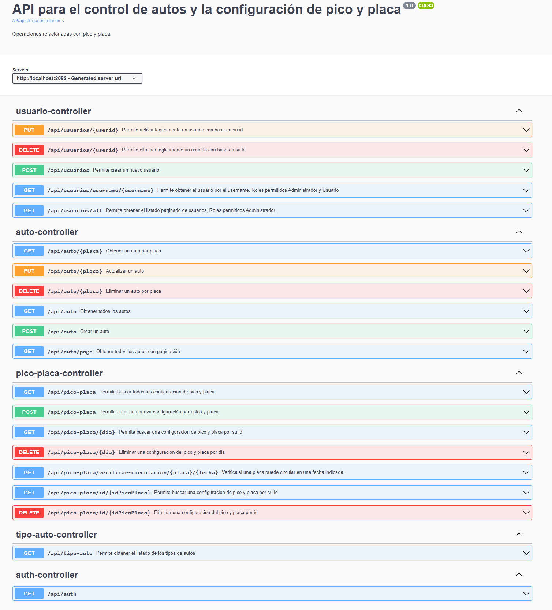

## Frontend

Para el frontend que está desarrollado en Angular se debe ingresar a la carpeta "reto-advance-latam-web" y ejecutar los siguientes comandos:

```bash
npm install
ng serve -c production
```

Con el anterior comando el aplicativo apunta al puerto 8080 del api rest.

Si se ejecuta el siguiente comando se accede al ambiente de desarrollo y el purto al que apunta el app para el api rest es 8082.

```bash
npm install
ng serve
```

# Uso del aplicativo

### Verificación de circulación

Después de eso se debe abrir en un navegador la url [http://localhost:4200](http://localhost:4200).

Se abrirá la siguiente pantalla

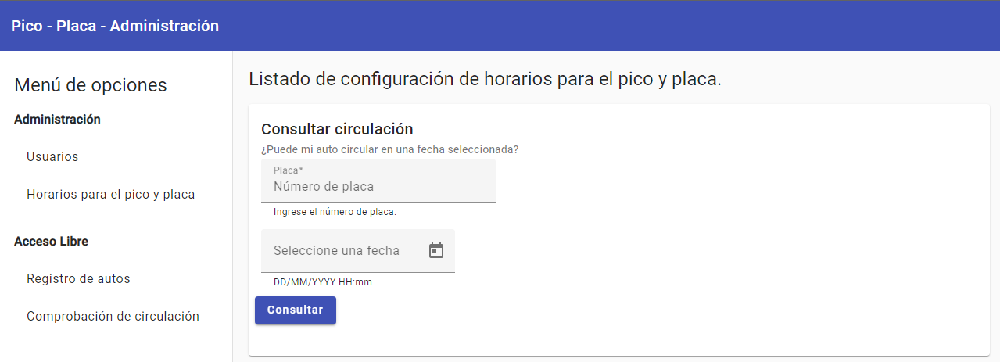

En donde se podrá comprobar si la placa de un auto tiene restricciones de circulación o no, pero primero se debe registrar en la base de datos una configuración de pico y placa. Si no se registra ninguna configuración, se mostrará el siguiente mensaje:

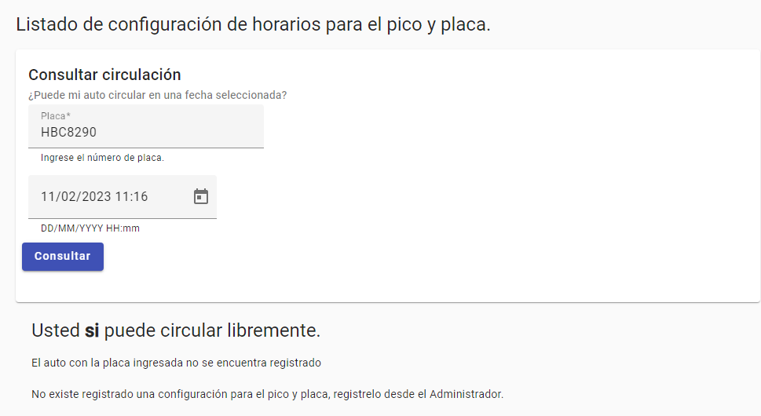

### Registro de configuración para pico y placa

Cuando se configura una restricción para el pico y placa se lo hará de la siguiente manera:

1. La opción "Horarios para el pico y placa" es autenticada, se puede ingresar con los datos admin/admin.

   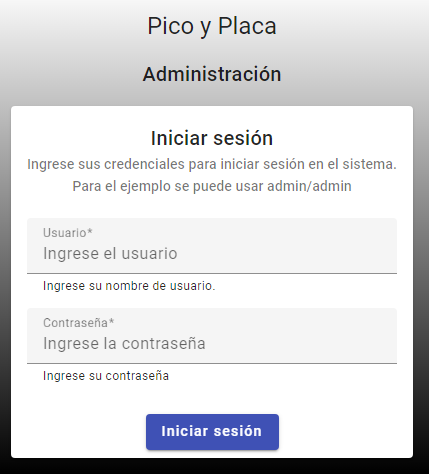

2. Y se mostrará el siguiente formulario

   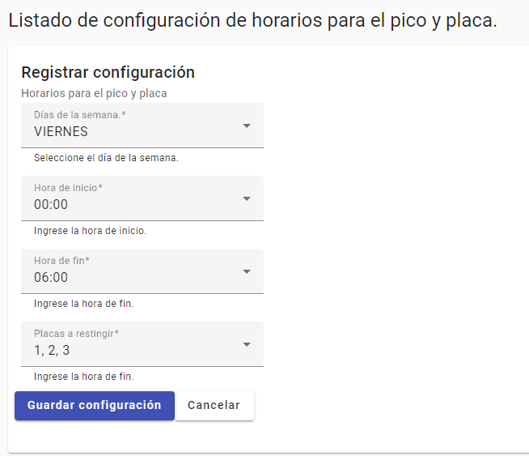

3. Después de registrarlos se mostrará la siguiente pantalla

   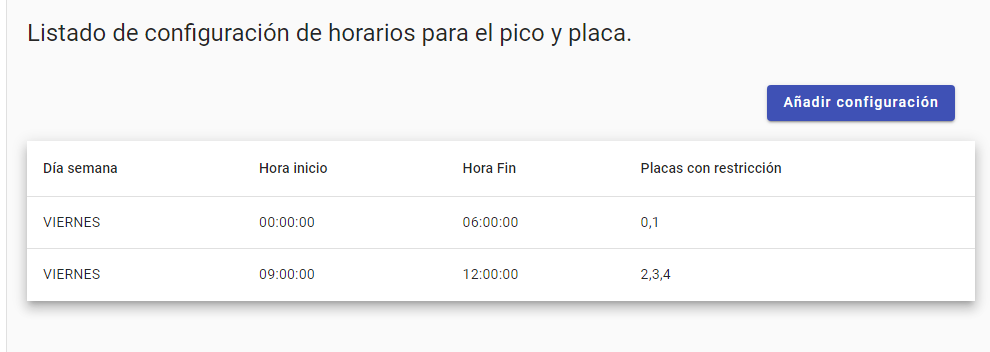

### Registro de autos

Cuando se haya registrado la configuración de pico y placa y se conpruebe si una placa puede circular o no, se mostrará la siguiente pantalla.

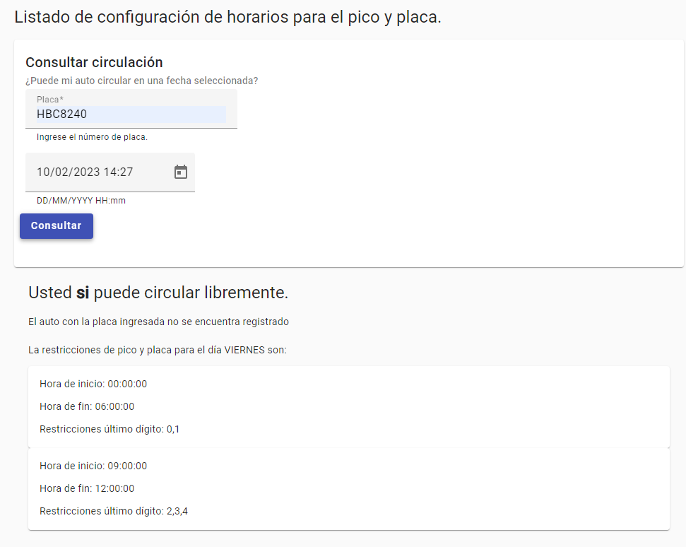

Debido a que el vehículo no está registrado en la base de datos, no se muestra información del auto.

Cuando se registra el auto desde esta pantalla

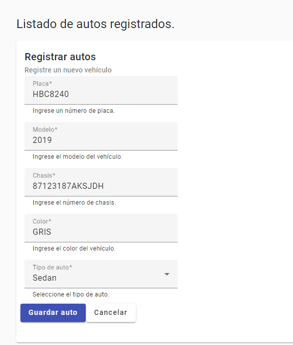

Se mostrará el siguiente listado

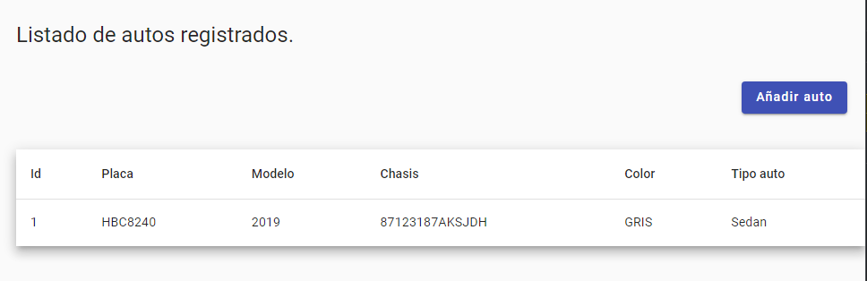

Después de eso si se verifica si una placa puede circular o no, se mostrará la siguiente pantalla

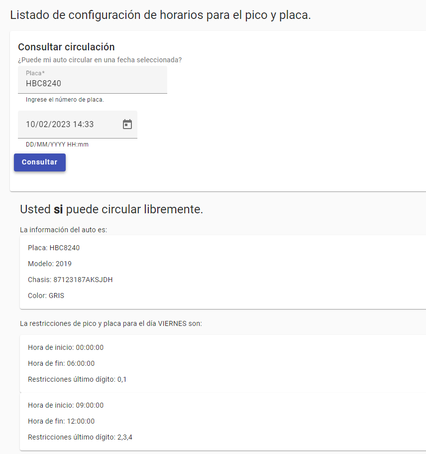

Y si no puede circular, se mostrará la siguiente pantalla

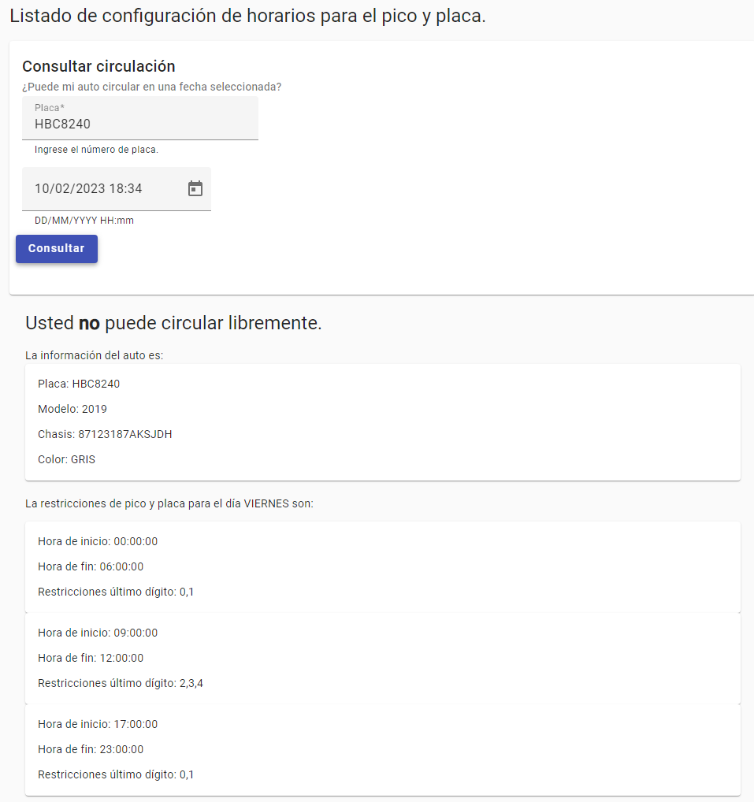
